<div align="center">

```
███████╗ ██████╗██████╗ ██╗██████╗ ███████╗
██╔════╝██╔════╝██╔══██╗██║██╔══██╗██╔════╝
███████╗██║     ██████╔╝██║██████╔╝█████╗  
╚════██║██║     ██╔══██╗██║██╔══██╗██╔══╝  
███████║╚██████╗██║  ██║██║██████╔╝███████╗
╚══════╝ ╚═════╝╚═╝  ╚═╝╚═╝╚═════╝ ╚══════╝
```

**Main courante numérique de gestion de crise hospitalière**  
**Digital Crisis Management Log for Healthcare Facilities**

[](https://github.com/nocomp/scribe)
[](LICENSE)
[](https://github.com/nocomp/scribe)
[](https://github.com/nocomp/scribe)

</div>

---

> 🇫🇷 **[Français](#-scribe--main-courante-de-crise-hospitalière)** | 🇬🇧 **[English](#-scribe--hospital-crisis-management-log)**

---

## 🇫🇷 SCRIBE — Main courante de crise hospitalière

SCRIBE est une plateforme open-source de **gestion de crise hospitalière** développée par le RSSI du Centre Hospitalier Annecy-Genevois (CHAG). Elle offre une main courante numérique complète, un collecteur territorial multi-établissements, et un module de debriefing post-crise alimenté par l'IA.

**Conçu pour les non-techniciens** — cadres soignants, directeurs, gestionnaires de crise — SCRIBE ne nécessite aucun cloud, aucun LDAP et fonctionne en réseau isolé.

### Captures d'écran

| Onglet VEILLE — Gestion des incidents | Onglet SOINS — Cartographie de situation |
|---|---|
| 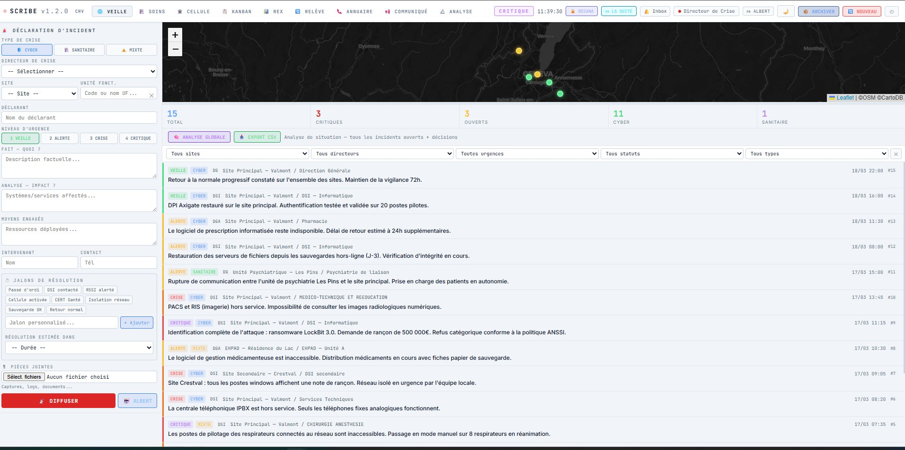 | 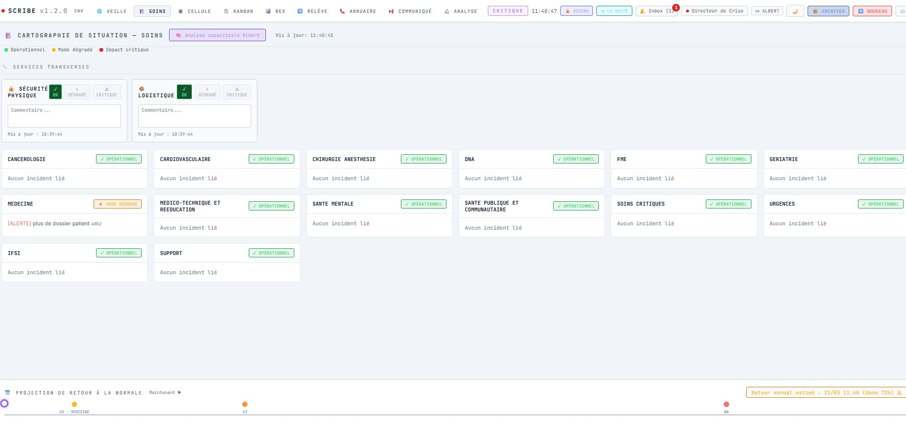 |

| Onglet CELLULE — Salle de crise | Onglet KANBAN — Tableau opérationnel |
|---|---|
| 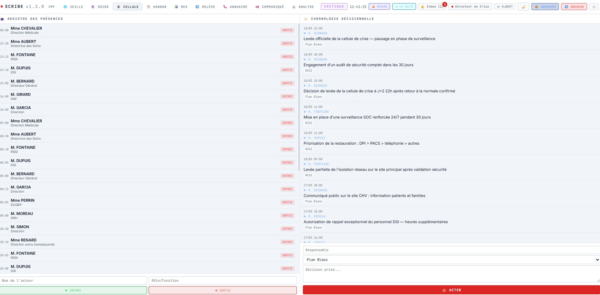 | 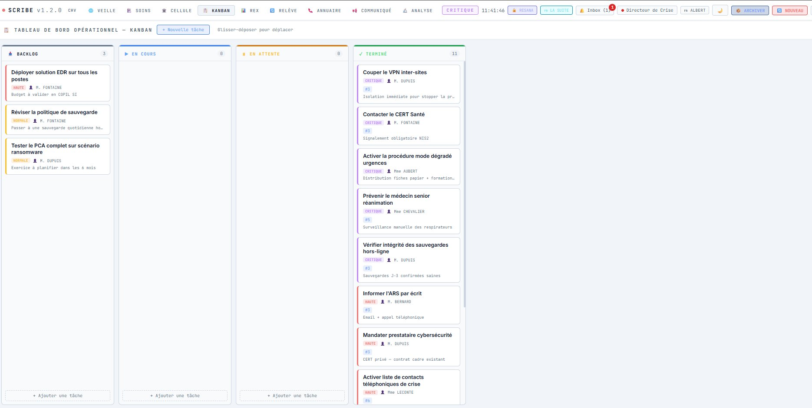 |

| Onglet COMMUNIQUÉ — Statut public | Collecteur territorial — Supervision |
|---|---|
| 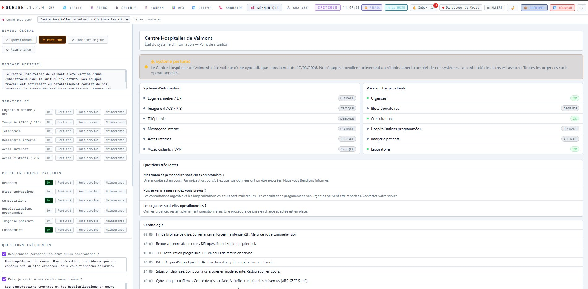 | 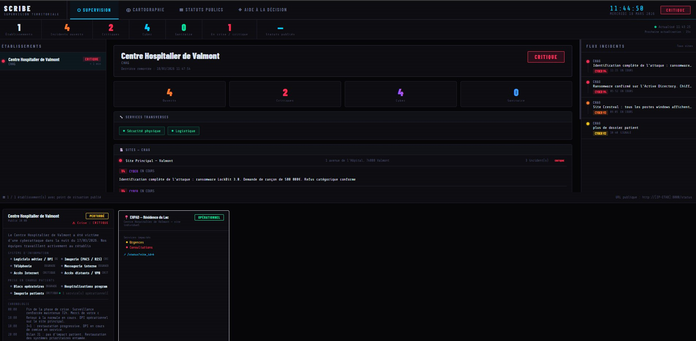 |

| Collecteur territorial — Cartographie |
|---|
| 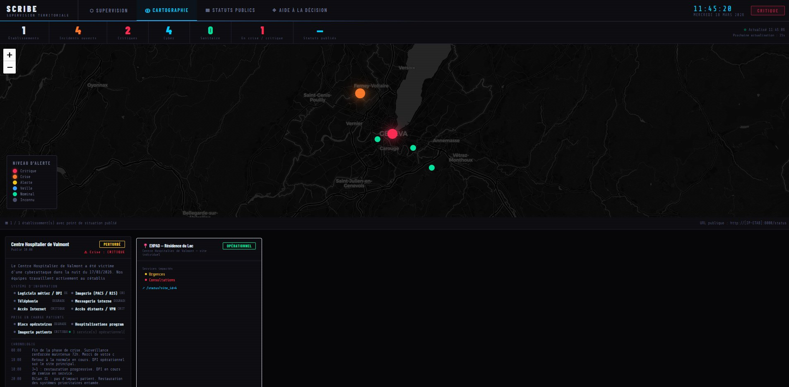 |

### Fonctionnalités principales

#### 🌐 VEILLE — Main courante incidents
- Déclaration d'incident : CYBER / SANITAIRE / MIXTE, niveaux 1 (VEILLE) à 4 (CRITIQUE)
- Jalons de résolution prédéfinis (DSI contacté, CERT Santé, Isolation réseau, Sauvegarde OK…) + jalons personnalisés
- Analyse IA par Albert (DINUM) — cyber ou sanitaire selon le type d'incident
- Analyse globale : Albert analyse tous les incidents ouverts + décisions cellule
- Timeline interactive avec projection de retour à la normale
- Export CSV des incidents

#### 🏥 SOINS — Cartographie capacitaire
- Vue par pôle clinique avec statut : OPÉRATIONNEL / MODE DÉGRADÉ / IMPACT CRITIQUE
- Incidents rattachés à chaque pôle/UF
- Analyse capacitaire Albert
- Frise temporelle de projection retour à la normale

#### 🏛️ CELLULE — Salle de crise
- Registre des présences horodaté (entrée/sortie, nom, rôle)
- Chronologie décisionnelle avec base réglementaire (Plan Blanc, NIS2, ORSAN…)
- Bouton ACTER pour enregistrer les décisions

#### 📋 KANBAN — Tableau opérationnel
- 4 colonnes : BACKLOG / EN COURS / EN ATTENTE / TERMINÉ
- Drag & drop entre colonnes
- Priorités, assignees, dates d'échéance, liens incidents

#### 📊 REX — Retour d'expérience
- Formulaire en langage opérationnel (non-technicien)
- Pré-remplissage automatique par Albert depuis les données de l'incident
- Export DOCX rapport de clôture

#### 🔄 RELÈVE — Passation de consignes
- Journal horodaté
- **Accusé de réception nominatif** : prénom + horodatage tracés

#### 📞 ANNUAIRE — Répertoire de crise
- Contacts nominaux et de secours (téléphonie cyber/IPBX)
- Bascule automatique vers numéros de secours en cas de crise

#### 📢 COMMUNIQUÉ — Statut public multi-sites
- Gestion multi-sites indépendante
- Niveaux : OPÉRATIONNEL / PERTURBÉ / DÉGRADÉ / ALERTE / CRITIQUE
- Services SI, prise en charge patients, FAQ, chronologie
- Page `/status?site_id=N` accessible sans authentification
- Push vers le collecteur territorial

#### 🔬 ANALYSE — Debriefing de crise *(nouveau v1.2.0)*
- Chargement ZIP d'archive par glisser-déposer (100% hors-ligne via JSZip embarqué)
- **8 métriques automatiques** : durée crise, délai activation cellule, délai communication publique, nb incidents, nb décisions, taux kanban, jalons validés, participants max
- **Frise chronologique interactive** : 7 catégories (incidents, décisions, cellule, kanban, relève, communiqués, REX), filtres, zoom
- **Annotations persistantes** : clic sur événement → annotation sauvegardée localement
- **Mode comparaison** : deux archives côte à côte pour mesurer la progression
- **Albert Analyse** : 6 questions rapides + question libre + synthèse de séance
- **Export rapport DOCX** debriefing structuré

### Gestion de fin de crise

| Action | Bouton | Effet |
|---|---|---|
| **📦 ARCHIVER** | Header | Crée un ZIP horodaté (`archives/crise_YYYYMMDD_HHMMSS.zip`) sans toucher aux données |
| **🔄 NOUVEAU** | Header | Remet le tableau de bord à zéro (double confirmation) |

### Collecteur territorial

Application indépendante (port 9000) qui agrège les remontées de plusieurs établissements :
- **Supervision** : liste établissements, KPIs, incidents, sites, services transverses
- **Cartographie** : marqueurs GPS colorés par niveau d'alerte
- **Statuts publics** : cartes par établissement et site
- **Flux incidents** : groupé par établissement puis par site géographique
- Protection par login/mot de passe (`setup_collecteur_auth.py`)

### IA — 7 fournisseurs supportés

| Fournisseur | Config | Notes |
|---|---|---|
| **Albert (DINUM)** | `albert` | ✅ Recommandé ES publics français — souverain |
| **Ollama** | `ollama` | 100% local, hors-ligne |
| OpenAI | `openai` | GPT-4 |
| Anthropic | `anthropic` | Claude |
| Mistral | `mistral` | api.mistral.ai |
| Gemini | `gemini` | Google |
| Compatible OpenAI | `openai_compat` | LM Studio, vLLM, Jan |

### Internationalisation

8 langues disponibles : **FR EN DE ES IT NL PL PT**

Configuration dans `config.xml` :
```xml
<langue>fr</langue>
```

### Installation rapide

```bash
# Linux
cd scribe/
pip install -r requirements.txt
cp config_demo1.xml config.xml    # démo CHV Valmont (5 sites, 106 UF)
python setup_demo1.py
python seed_demo_crise.py          # données ransomware LockBit 48h (optionnel)
python main.py
# → http://localhost:8000  (login: dircrise / voir config.xml)
```

```powershell
# Windows PowerShell
copy config_demo1.xml config.xml
python setup_demo1.py
python seed_demo_crise.py
python main.py
```

### Collecteur territorial

```bash
cd collecteur/
pip install -r collecteur_requirements.txt
python setup_collecteur_auth.py    # optionnel — protéger par login
python collecteur.py
# → http://localhost:9000

# Enregistrer un établissement
curl -X POST http://localhost:9000/api/admin/tokens \
  -H "Authorization: Bearer TOKEN_ADMIN" \
  -H "Content-Type: application/json" \
  -d '{"sigle":"MONCH","token":"TOKEN_ETABLISSEMENT_16CHARS_MIN"}'
```

### Configuration `config.xml`

```xml
<scribe>
  <etablissement>
    <nom>Centre Hospitalier de Valmont</nom>
    <sigle>CHV</sigle>
  </etablissement>
  <admin>
    <login>dircrise</login>
    <password>MotDePasse!</password>
  </admin>
  <langue>fr</langue>  <!-- fr en de es it nl pl pt -->
  <ia>
    <fournisseur>albert</fournisseur>
    <cle_api>sk-...</cle_api>
    <modele>mistralai/Ministral-3-8B-Instruct-2512</modele>
    <url_base>https://albert.api.etalab.gouv.fr/v1/chat/completions</url_base>
  </ia>
  <federation>
    <enabled>true</enabled>
    <collecteur_url>http://IP-COLLECTEUR:9000/api/push</collecteur_url>
    <token>TOKEN_16_CHARS_MIN</token>
    <intervalle_secondes>30</intervalle_secondes>
  </federation>
</scribe>
```

### Scénario de démonstration

Le script `seed_demo_crise.py` génère un scénario ransomware LockBit complet (48h) :
- 15 incidents sur 5 sites, 8 pôles cliniques
- 22 décisions actées (Plan Blanc, NIS2, ORSAN)
- 20 tâches kanban (dont 11 TERMINÉES)
- 10 consignes de relève avec accusés nominatifs
- 5 fiches REX
- 2 communiqués publics multi-sites

Parfait pour tester l'onglet **ANALYSE** : archivez la crise (`📦 ARCHIVER`), puis chargez le ZIP dans l'onglet ANALYSE.

### Architecture

```
scribe_suite/
├── scribe/                    ← Application établissement (port 8000)
│   ├── main.py               ← Point d'entrée FastAPI
│   ├── setup_demo1.py        ← Démo CHV Valmont (5 sites, 106 UF)
│   ├── seed_demo_crise.py    ← Scénario ransomware LockBit 48h
│   ├── config_demo1.xml      ← Configuration démo
│   ├── DEPLOY_WINDOWS.bat    ← Script de déploiement Windows
│   └── app/
│       ├── static/index.html ← SPA complète (~338 Ko, JSZip embarqué)
│       ├── lang/             ← i18n : fr en de es it nl pl pt
│       └── api/
│           ├── sitrep.py     ← Incidents (CRUD, jalons, PJ)
│           ├── cellule.py    ← Présences + décisions
│           ├── tasks.py      ← Kanban
│           ├── releve.py     ← Consignes + accusés nominatifs
│           ├── rex.py        ← Retour d'expérience
│           ├── rapport.py    ← Export DOCX, archivage, fin de crise
│           ├── albert.py     ← Endpoints IA
│           ├── ai_router.py  ← Abstraction multi-fournisseurs
│           └── status_page.py← Communiqués publics
└── collecteur/               ← Superviseur territorial (port 9000)
    ├── collecteur.py         ← FastAPI mono-fichier
    └── setup_collecteur_auth.py
```

### Conformité réglementaire

| Référentiel | Couverture |
|---|---|
| **NIS2** | Traçabilité décisions, jalons CERT Santé, chronologie |
| **Plan Blanc** | Activation cellule, registre présences, diffusion |
| **CERT Santé** | Jalon dédié, signalement intégré |
| **HDS / RGPD** | Déploiement local, zéro cloud obligatoire |
| **ORSAN** | Base réglementaire des décisions |

### Déploiement production (Linux systemd)

```ini
[Unit]
Description=SCRIBE Crisis Management
After=network.target

[Service]
User=scribe
WorkingDirectory=/opt/scribe
ExecStart=/usr/bin/python3 main.py
Restart=always

[Install]
WantedBy=multi-user.target
```

---

## 🇬🇧 SCRIBE — Hospital Crisis Management Log

SCRIBE is an open-source **hospital crisis management platform** developed by the CISO of Centre Hospitalier Annecy-Genevois (CHAG). It provides a complete digital crisis log, a multi-facility territorial collector, and an AI-powered post-crisis debriefing module.

**Designed for non-technical staff** — nursing managers, directors, crisis coordinators — SCRIBE requires no cloud, no LDAP, and runs fully offline on an isolated network.

### Key Features

#### 🌐 WATCH — Incident Log
- Incident declaration: CYBER / HEALTH / MIXED, urgency levels 1 (WATCH) to 4 (CRITICAL)
- Predefined resolution milestones (IT contacted, CERT Santé, network isolation, backup OK…) + custom milestones
- AI analysis by Albert (DINUM) — cyber or health depending on incident type
- Global analysis: Albert analyses all open incidents + cell decisions
- Interactive timeline with estimated return-to-normal projection
- CSV export

#### 🏥 CARE — Capacity Mapping
- View by clinical department with status: OPERATIONAL / DEGRADED MODE / CRITICAL IMPACT
- Incidents linked to each department/functional unit
- Albert capacity analysis
- Return-to-normal projection timeline

#### 🏛️ CELL — Crisis Room
- Timestamped attendance register (entry/exit, name, role)
- Decision log with regulatory basis (White Plan, NIS2, ORSAN…)
- RECORD button for formalising decisions

#### 📋 KANBAN — Operational Board
- 4 columns: BACKLOG / IN PROGRESS / WAITING / DONE
- Drag & drop between columns
- Priorities, assignees, due dates, incident links

#### 📊 REX — Experience Feedback
- Plain-language form (non-technical staff)
- Auto-fill by Albert from incident data
- DOCX closure report export

#### 🔄 HANDOVER — Shift Handover
- Timestamped log
- **Named acknowledgement**: first name + timestamp recorded

#### 📞 DIRECTORY — Crisis Directory
- Standard and emergency contacts (cyber/IPBX telephony)
- Automatic switch to emergency numbers

#### 📢 BULLETIN — Public Status (multi-site)
- Independent per-site management
- Levels: OPERATIONAL / DISRUPTED / DEGRADED / ALERT / CRITICAL
- IT services, patient care, FAQ, timeline
- Public page `/status?site_id=N` accessible without authentication
- Push to territorial collector

#### 🔬 ANALYSIS — Crisis Debrief *(new in v1.2.0)*
- ZIP archive upload by drag-and-drop (100% offline via embedded JSZip)
- **8 automatic metrics**: crisis duration, cell activation delay, first public comms delay, incident count, decision count, kanban completion rate, validated milestones, max participants
- **Interactive chronological timeline**: 7 categories, filters, zoom
- **Persistent annotations**: click an event → annotation saved locally
- **Comparison mode**: two archives side by side to measure progression
- **Albert Analysis**: 6 quick questions + free question + session summary
- **DOCX report export**

### Crisis End Management

| Action | Button | Effect |
|---|---|---|
| **📦 ARCHIVE** | Header | Creates a timestamped ZIP without touching live data |
| **🔄 NEW** | Header | Resets the dashboard (double confirmation required) |

### Territorial Collector

Independent application (port 9000) aggregating data from multiple facilities:
- **Supervision**: facility list, KPIs, incidents, sites, transverse services
- **Mapping**: GPS markers colour-coded by alert level
- **Public statuses**: cards per facility and site
- **Incident feed**: grouped by facility then by geographic site
- Login/password protection (`setup_collecteur_auth.py`)

### AI — 7 supported providers

| Provider | Config | Notes |
|---|---|---|
| **Albert (DINUM)** | `albert` | ✅ Recommended for French public health — sovereign |
| **Ollama** | `ollama` | 100% local, fully offline |
| OpenAI | `openai` | GPT-4 |
| Anthropic | `anthropic` | Claude |
| Mistral | `mistral` | api.mistral.ai |
| Gemini | `gemini` | Google |
| OpenAI-compatible | `openai_compat` | LM Studio, vLLM, Jan |

### Internationalisation

8 languages available: **FR EN DE ES IT NL PL PT**

Set in `config.xml`:
```xml
<langue>en</langue>
```

<<<<<<< HEAD
### Quick Install
=======
### Séquence de démarrage

1. Démarrer le collecteur **en premier**
2. Configurer `<federation>` dans chaque `config.xml`
3. `python setup.py` + `python main.py` sur chaque SCRIBE
4. Enregistrer chaque établissement (curl ci-dessus)
5. Vérifier dans les logs : `push_status OK`

---

## Changelog

### v1.1.0
- Internationalisation — 8 langues européennes
- Marqueurs GPS distincts par site dans le collecteur
- Statuts publics par site (COMMUNIQUÉ multi-sites)
- Supervision collecteur : sites en sous-entités
- Correctif : référence circulaire dans le push fédération
- Correctif : scroll supervision collecteur
- Boutons RESANA et LA SUITE dans le header
- SITE_MAPPING `import_uf2.py` corrigé

### v1.0.0 (RC)
- Main courante complète (8 onglets)
- Collecteur territorial multi-établissements
- Module COMMUNIQUÉ / statut public
- IA Albert + 6 fournisseurs
- Export DOCX rapport / REX

---

## Licence

MIT — Centre Hospitalier Annecy-Genevois (CHANGE) — RSSI

---
---

# SCRIBE — Hospital Crisis Management Platform

> **Version française ci-dessus**

---

**SCRIBE** is an open-source crisis management logbook for healthcare facilities.  
Runs on an **isolated network** — no Internet, no LDAP, no cloud dependency.  
MIT License — Repository: https://github.com/nocomp/scribe

---

## Screenshots

| Watch & Incidents | Care Map |
|---|---|
| 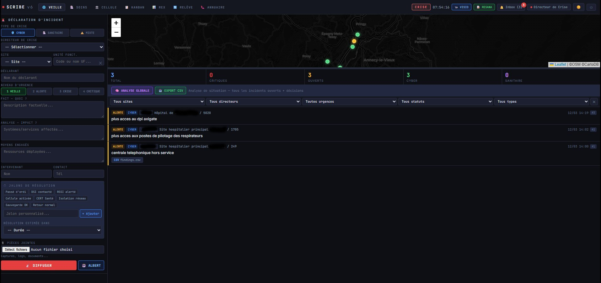 | 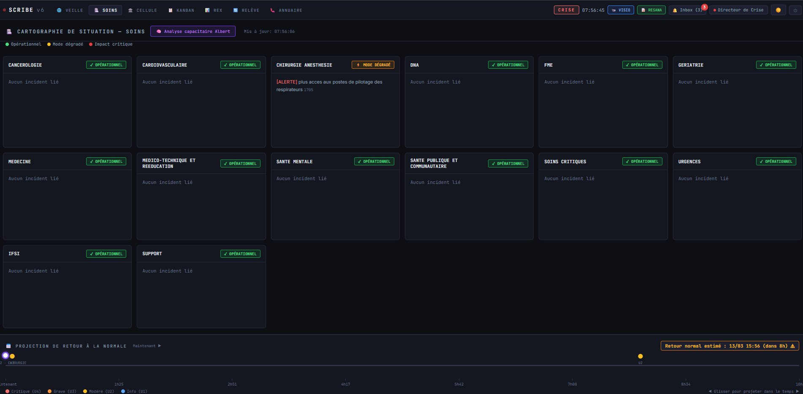 |

| Crisis Cell | Kanban |
|---|---|
| 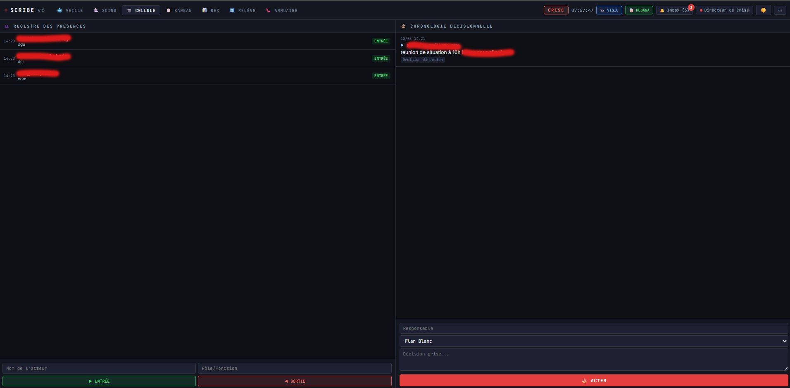 | 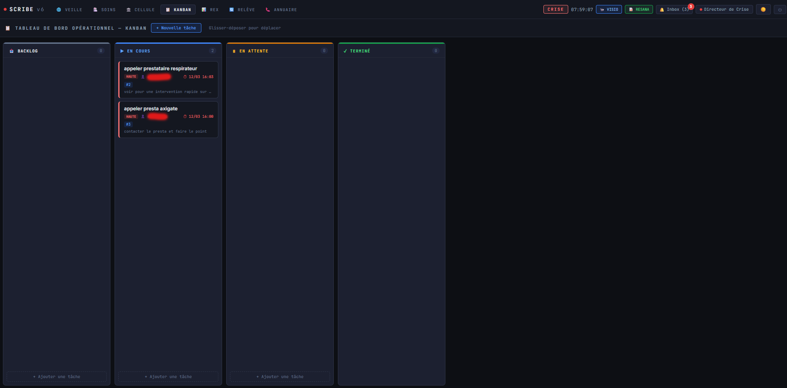 |

| AAR | Handover |
|---|---|
| 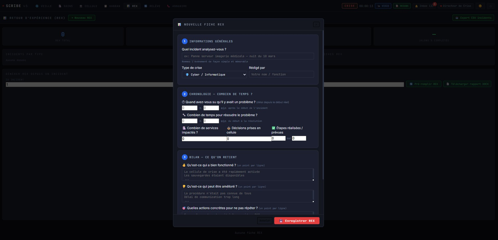 | 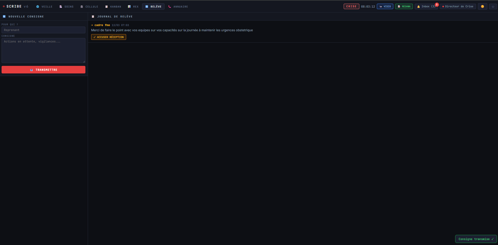 |

| Directory | Collector — Supervision |
|---|---|
| 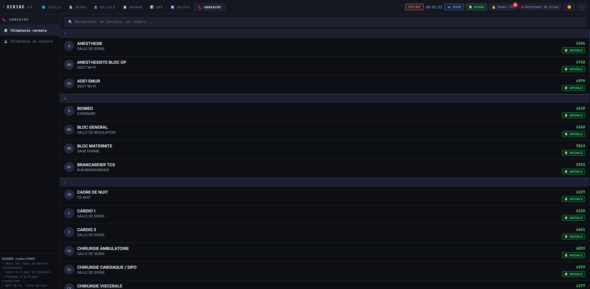 | 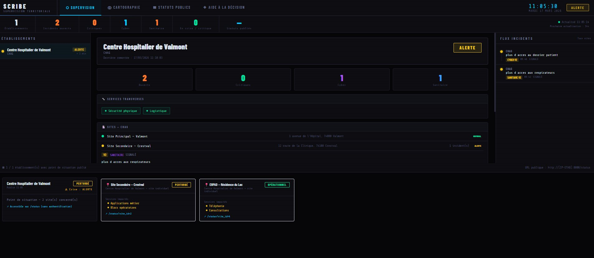 |

| Collector — Public Status | Collector — Map |
|---|---|
| 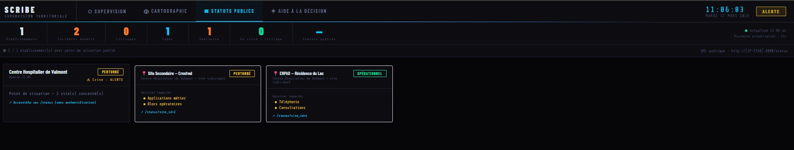 | 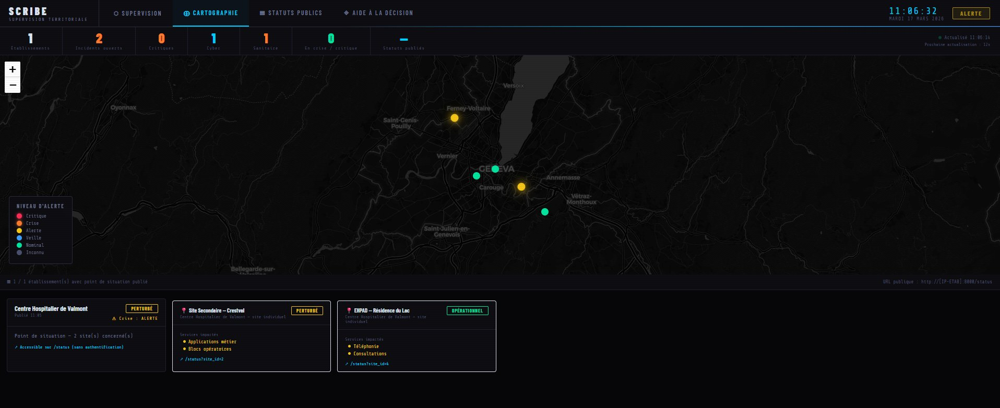 |

---

## Features

- **Watch & Incidents** — Declaration, tracking, milestones, integrated AI
- **Care** — Clinical department map, return-to-normal projection
- **Crisis Cell** — Attendance register, decision timeline
- **Kanban** — Operational dashboard, drag & drop
- **AAR** — After-action review, DOCX export
- **Handover** — Timestamped notes, acknowledgement receipts
- **Directory** — Nominal and backup contacts, telephony toggle
- **Bulletin** — Public status per site, push to territorial collector
- **Territorial Supervision** — Multi-facility collector, GPS map, public statuses
- **Internationalisation** — 8 European languages (fr, en, de, es, it, nl, pl, pt)

---

## Quick Start

### 1. SCRIBE (facility)
>>>>>>> c8b26ebcd50ddd3fcbd53b18d5ba1b324f08cd6c

```bash
# Linux
cd scribe/
pip install -r requirements.txt
cp config_demo1.xml config.xml    # demo CHV Valmont (5 sites, 106 functional units)
python setup_demo1.py
python seed_demo_crise.py          # 48h LockBit ransomware scenario (optional)
python main.py
# → http://localhost:8000  (login: dircrise / see config.xml)
```

```powershell
# Windows PowerShell
copy config_demo1.xml config.xml
python setup_demo1.py
python seed_demo_crise.py
python main.py
```

### Territorial Collector

```bash
cd collecteur/
pip install -r collecteur_requirements.txt
python setup_collecteur_auth.py    # optional — add login protection
python collecteur.py
# → http://localhost:9000

# Register a facility
curl -X POST http://localhost:9000/api/admin/tokens \
  -H "Authorization: Bearer ADMIN_TOKEN" \
  -H "Content-Type: application/json" \
  -d '{"sigle":"MYHOSP","token":"FACILITY_TOKEN_16CHARS_MIN"}'
```

### Demo Scenario

`seed_demo_crise.py` generates a complete 48h LockBit ransomware scenario:
- 15 incidents across 5 sites and 8 clinical departments
- 22 recorded decisions (White Plan, NIS2, ORSAN)
- 20 kanban tasks (11 DONE)
- 10 shift handover instructions with named acknowledgements
- 5 REX forms
- 2 multi-site public bulletins

Perfect for testing the **ANALYSIS** tab: archive the crisis (`📦 ARCHIVE`), then load the ZIP in the ANALYSIS tab.

### Regulatory Compliance

| Framework | Coverage |
|---|---|
| **NIS2** | Decision traceability, CERT Santé milestones, timeline |
| **White Plan** | Cell activation, attendance register, communications |
| **CERT Santé** | Dedicated milestone, integrated reporting |
| **HDS / GDPR** | Local deployment, zero mandatory cloud |
| **ORSAN** | Regulatory basis for decisions |

---

## Licence / License

MIT — Développé par le RSSI du CHAG · Developed by the CISO of CHAG  
Contributions bienvenues · Contributions welcome

<<<<<<< HEAD
**Dépôt / Repository**: https://github.com/nocomp/scribe  
**Version**: 1.2.0 — Mars / March 2026
=======
### v1.0.0 (RC)
- Full crisis logbook (8 tabs)
- Multi-facility territorial collector
- Bulletin / public status module
- Albert AI + 6 other providers
- DOCX closure report / AAR export

---

## Licence

MIT — Centre Hospitalier Annecy-Genevois (CHANGE)
>>>>>>> c8b26ebcd50ddd3fcbd53b18d5ba1b324f08cd6c
